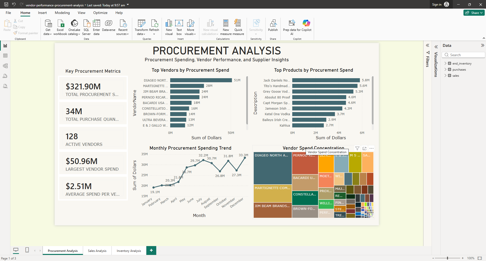
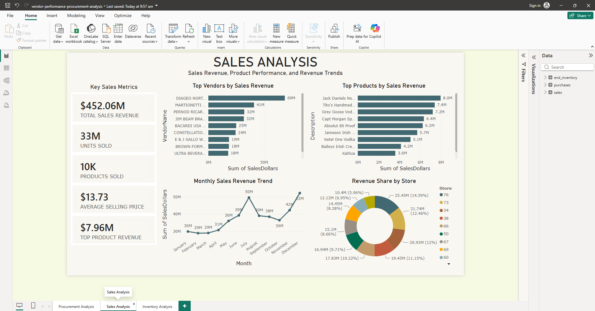
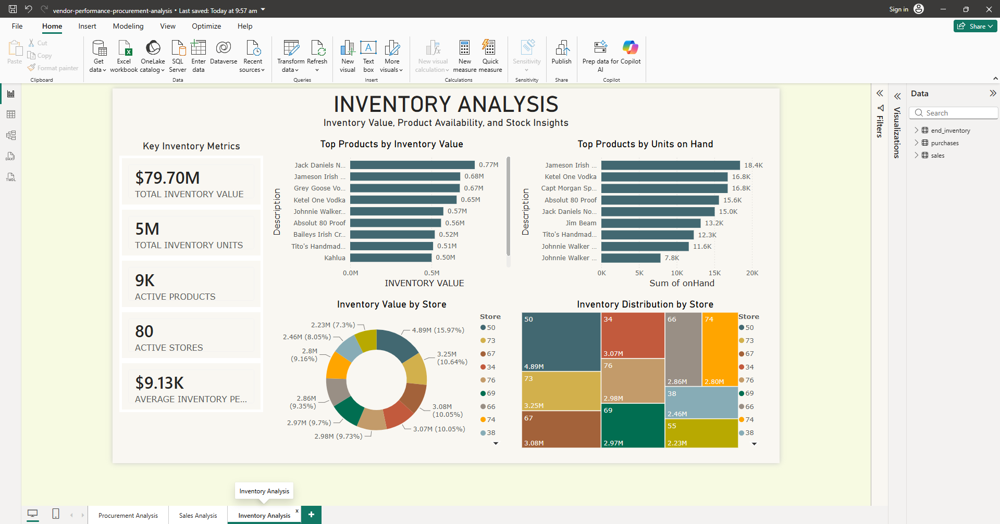

# Vendor Performance & Procurement Insights Dashboard
> Note: This is my first Data Analytics Portfolio Project.

## Overview
To develop my data analytics skills, I worked with a procurement, inventory, and sales dataset that closely aligns with my professional background in costing, procurement support, and commercial reporting.

Using SQL and Power BI, I analyzed vendor performance, procurement spending, sales trends, and inventory management to generate business insights and recommendations.

## Skills Demonstrated
- SQL
- Data Cleaning
- Data Validation
- Power BI
- Data Visualization
- KPI Development
- Procurement Analysis
- Inventory Analysis
- Business Reporting

## Dashboard Screenshots
### Procurement Dashboard

### Sales Dashboard

### Inventory Dashboard

## Dataset
This project uses the Vendor Performance Analysis dataset from Kaggle.
Source:
https://www.kaggle.com/datasets/harshmadhavan/vendor-performance-analysis

The dataset contains information related to vendors, purchases, inventory, pricing, and sales transactions.

## Objectives
Through this project, I aim to:

* Practice working with large datasets
* Improve my SQL skills
* Learn basic data modeling concepts
* Create an interactive Power BI dashboard
* Develop reporting and data storytelling skills
* Gain experience working with data stored in a database

## Questions I Want to Explore
* Which vendors account for the highest procurement spending?
* Which vendors generate the highest sales value?
* Is spending concentrated among a small number of vendors?
* Which products have the highest purchase cost?
* Which products generate the highest sales revenue?
* What are the procurement spending trends over time?
* What are the sales trends over time?
* Which products have the highest inventory value?
* Are there products with high inventory levels but low sales activity?
* What insights can be identified to support procurement and inventory management decisions?

## Project Timeline
| Milestone             | Date                 |
| --------------------- | -------------------- |
| Project Started       | 15 June 2026         |
| Dataset Review        | 15 June 2026         |
| Data Cleaning         | 15-16 June 2026      |
| SQL Analysis          | 16-17 June 2026      |
| Dashboard Development | 17-19 June 2026      |
| Project Completion    | 19 June 2026         |

## Tools
* SQLite (DB Browser for SQLite)
* DBeaver
* Power BI
* AI Productivity Tool (ChatGPT and Claude)

## Project Status
✅ Completed

