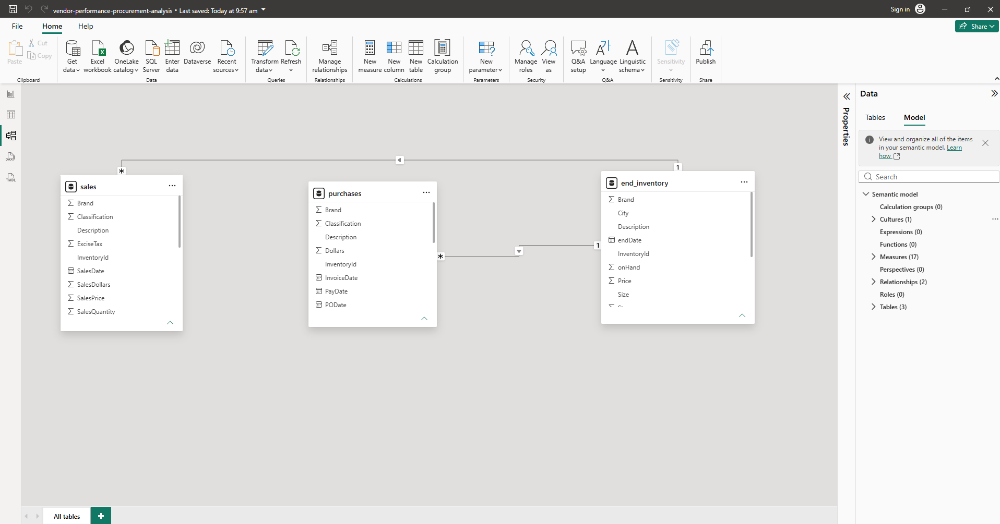

# Vendor Performance & Procurement Insights Dashboard
> Note: This is my first Data Analytics Portfolio Project.

## Overview
To develop my data analytics skills, I worked with a procurement, inventory, and sales dataset that closely aligns with my professional background in costing, procurement support, and commercial reporting.

Using SQL and Power BI, I analyzed vendor performance, procurement spending, sales trends, and inventory management to generate business insights and recommendations.

## Objectives
Through this project, I aim to:

* Practice working with large datasets
* Improve my SQL skills
* Learn basic data modeling concepts
* Create an interactive Power BI dashboard
* Develop reporting and data storytelling skills
* Gain experience working with data stored in a database

## Questions I Want to Explore
- Which vendors account for the highest procurement spending?
- Which vendors generate the highest sales value?
- Is procurement spending concentrated among a small number of vendors?
- Which products account for the highest procurement spending?
- Which products generate the highest sales revenue?
- What are the procurement spending trends over time?
- What are the sales trends over time?
- How does procurement spending compare with sales revenue?
- Which products have the highest inventory value?
- Are there products with high inventory levels but low sales activity?
- What insights can support procurement and inventory management decisions?

## Tools
* SQLite (DB Browser for SQLite)
* DBeaver
* Power BI
* AI Productivity Tool (ChatGPT and Claude)

## Skills Demonstrated
- SQL
- Data Cleaning
- Data Validation
- Power BI
- Data Visualization
- KPI Development
- Procurement Analysis
- Inventory Analysis
- Business Reporting

## Dashboard Screenshots
> ### Procurement Dashboard

> ### Sales Dashboard

> ### Inventory Dashboard

## Data Model
The Power BI dashboard was developed using the primary analytical tables:
- purchases
- sales
- end_inventory
> 
> Relationships
- sales → purchases (many-to-one)
- purchases → end_inventory (many-to-one)

The relationships enable analysis of procurement spending, sales performance, and inventory value across products.

## Dataset
This project uses the Vendor Performance Analysis dataset from Kaggle.
> Source: https://www.kaggle.com/datasets/harshmadhavan/vendor-performance-analysis

The dataset contains information related to vendors, purchases, inventory, pricing, and sales transactions.

## Project Documentation

### Data Preparation
- [Dataset Review](Documentation/1_dataset_review.md)
- [Data Cleaning](Documentation/2_dataset_cleaning.md)
### Analysis
- [Procurement Analysis](Documentation/3_procurement-analysis.md)
- [Sales Analysis](Documentation/4_sales-analysis.md)
- [Product & Inventory Analysis](Documentation/5_product-inventory-analysis.md)
### Reporting
- [Dashboard Development](Documentation/6_dashboard-development.md)
- [Final Findings & Recommendations](Documentation/7_final-findings-recommendations.md)

### Project Timeline
| Milestone             | Date                 |
| --------------------- | -------------------- |
| Project Started       | 15 June 2026         |
| Dataset Review        | 15 June 2026         |
| Data Cleaning         | 15-16 June 2026      |
| SQL Analysis          | 16-17 June 2026      |
| Dashboard Development | 17-19 June 2026      |
| Project Completion    | 19 June 2026         |

## Project Status
✅ Completed

